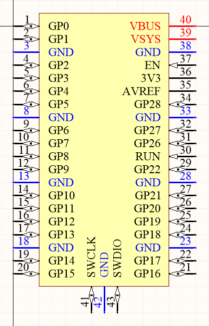
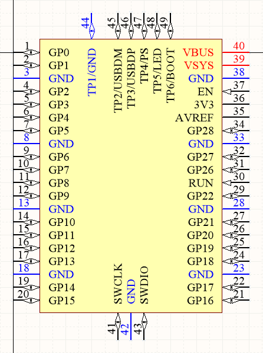
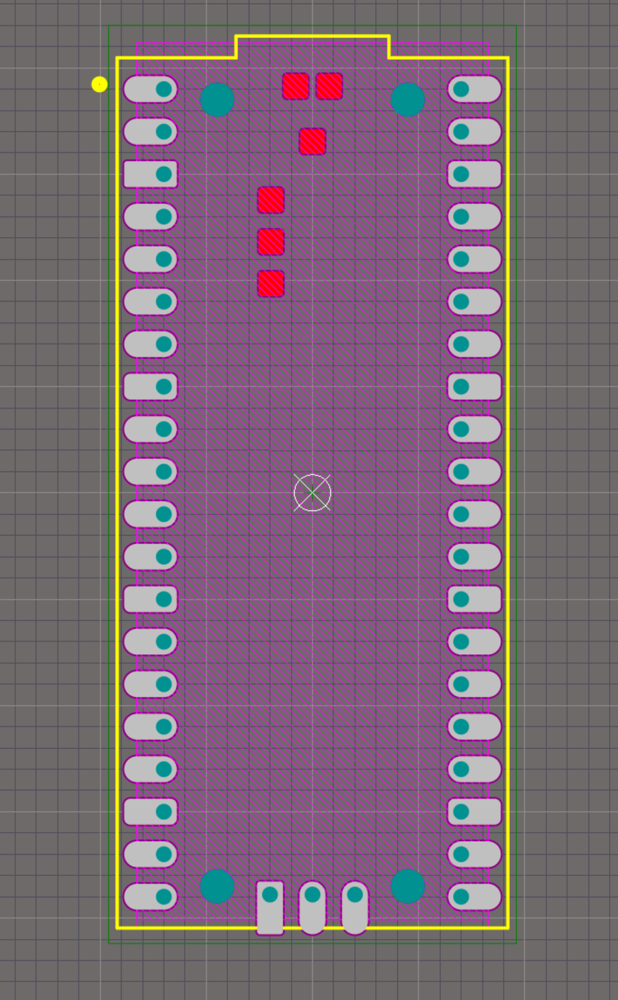
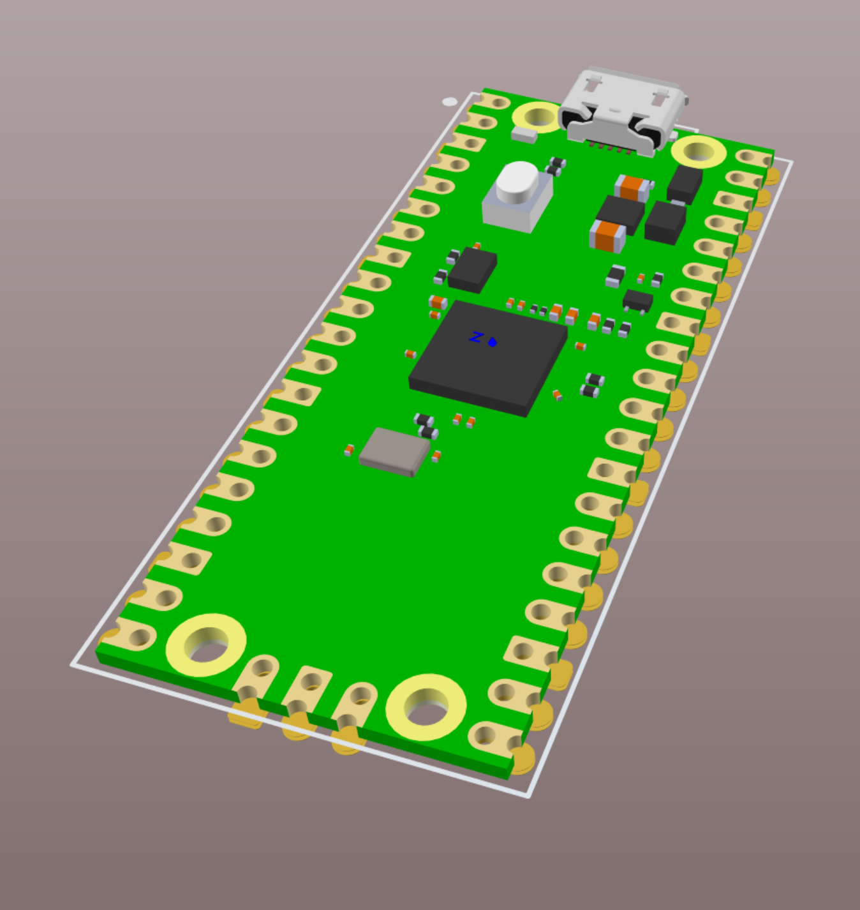

# Altium Library for Raspberry Pi Pico board

The footprint is made using custom pads with rounded shape as described in the board's datasheet, and also includes pads for test points.

Symbols (1 - without test pads, 2 - with TPs):
  

Footprint:

Great thank to Hasanain Shuja for a nice 3D model! Don't forget to give him a like here:
https://grabcad.com/library/raspberry-pi-pico-r3-1

## TODO

* [ ] Draw mounting holes of the Pico board on the Mech-13 layer (or add a new footprint with drilled ones).
* [ ] Add miled holes under micro-USB socket (for better soldering) as it is described in the board's datasheet.
* [ ] Make GND pads rounded rectangular as on the Pico board.

## Contribution

If you have something to add or fix in this library, I will very appreciate you, if you contribute via Pull Request. Thank you!

## Licence

If you want to use this library, just let me know by staring this repository, and feel free to use it in both  commercial and non-commercial projects!

Thank you! :)
